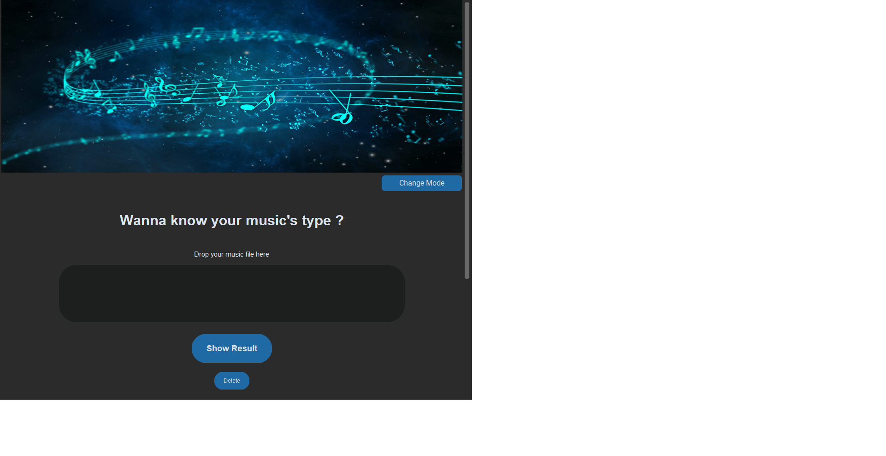

Music_CLassification_App guideline  
1.STEP 1: 
  Generate CSV file: Run the CSV_generate notebook steps by steps, this will generate the features_30_sec.csv file in the Data folder  
2.STEP 2: Next step, we will select the appropiate model for music application:  
  Run the Model_selection notebook steps by steps, the notebook also have visualization for user.   
3.STEP 3: Run the GUI.py file: A window will show up for user like this:  
  
  Please drop your audio file ( must be 30 seconds length) into the entry box  
  Then click on the 'Show Result' button.  
  One other window will appear and show you the result predicted by our 3 selected models   
     
  You can turn off the window or press 'Turn back!' button to process your next classification.
  

